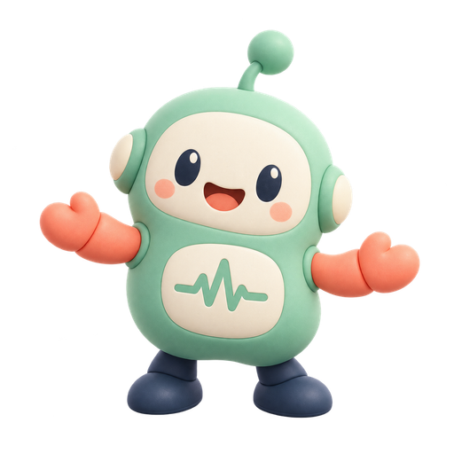

# Dopa Fit / ドパフィット

**Move your body. Build the beat.**

[**Play Dopa Fit → https://dopa-fit.vercel.app/**](https://dopa-fit.vercel.app/)

スマートフォンのインカメラで身体をコントローラーにする、独立したOSSフィットネス実験。手を伸ばしてターゲットに触れると、音楽・光・Particle・ENERGY・FEVERが育ちます。静的HTML・JavaScriptだけで動作し、ビルド・サーバーAPI・ログインは不要です。



現在は**公開候補版**です。Androidで音と手振りが動作し、音声改善後にはiPhoneでも音が出たとの利用者報告があります。rc.8では縦画面いっぱいのカメラ、広い手の周辺判定、短い認識途切れへの補助、より大きなリング・光・粒子を追加しました。新演出の実機評価、機種／OSの特定、長時間の性能・発熱・バッテリー評価は未完了です。[確認状況](docs/release-checklist.md)を参照してください。

## Concept

Movement creates reward. 身体を動かすほど音楽の編成と光の演出が豊かになります。累計ENERGYと解放済みの楽器は、休憩や認識が途切れても保持します。

## Philosophy

- No MISS
- No penalty
- No game over
- Movement creates reward
- Success makes the experience richer

## How to Play

1. スマートフォンを安定した場所に立て、縦画面でDopa Fitを開く。
2. START MOVINGを押し、カメラを許可する。
3. 肩と両手が画面内に映る位置まで離れ、3秒の準備を待つ。
4. GOのターゲットへ、好きな手をゆっくり伸ばす。光る側とNEXTを追うと左右交互に動けます。別のターゲットに触れても成功です。速さ・方向・拍の正確さは必要ありません。
5. 手の動きでビートを育てる。ENERGYが100増えるたびFEVERへ。
6. ひと息つきたいときはPause。音量や演出を設定し、「また動こう」で再開。成果はそのまま。

カメラは標準で画面いっぱいに中央を切り抜いて表示します。肩・両手が入る距離へ調整してください。Pauseの「カメラ表示 → 全身を映す」では元の映像全体を表示でき、3分コースの全身運動にも使えます。iPhoneではSafariの共有メニューから「ホーム画面に追加」し、追加したアイコンから開くとブラウザのバーがない広い画面で遊べます。

手首から肘と反対の方向へ少し補正した位置に、半径20〜40pxの手の周辺判定を設けています。大きくしたターゲットに周辺の円が重なればHIT。手首の信頼度はHITだけ0.3以上で拾い、運動の回数・MOVEでは従来の条件を維持します。認識が欠けたときは表示を最大320ms保ち、直前の肘が追えている場合だけ最大220ms動きを補助します。表示の保持だけで加点せず、長い追跡欠落・新しいターゲットへの重なり・手を置き続ける動作で連打しません。

START時に短い確認音を鳴らします。音が聞こえない場合は、Pause内の「音を有効にする」／「音を試す」をタップしてください。設定中はカメラとBGMを休止し、確認音で音声を再起動します。ENERGYと時間は保持し、「また動こう」のタップで再開します。音の開始に失敗した場合はプレイ画面に「音を有効に ♪」が現れます。端末の音量・消音設定も確認できます。対応ブラウザでは音楽再生用Audio Sessionを設定します。実機での修正確認は継続中です。[音声の確認手順](docs/audio-compatibility.md)。

ターゲット外の手振りにも控えめなペンタトニック音と「MOVE +1」を返します。両手合計で最大2回／秒、静止・再検出では発音しません。HITと同時の場合はHITの音と表示を優先します。

HITで約280msの収縮・白い局所フラッシュ・三重リング、約190msの合成音と短い粒子爆発を連動。手のTrailは約240ms残ります。速い動きでは演出を最大35%強めますが、ゆっくり触れても同じHIT +5です。通常は左右各4段、計8か所の候補から配置。画面端で重なる候補は除外します。触れるターゲットは最大2個、予告は最大1個で、HIT後は次の場所へ小さなNEXTタイルが近づき、拍に沿って次が現れます。予告はまだ判定せず、到着後の円がタッチ範囲です。逃しても静かに次へ移り、減点しません。Pauseの「その場で小さく」で動く範囲を縮められます。FEVERでは上下の組み合わせ、ひと息では穏やかな配置へ変わります。楽器解放でNEW SOUND、累計HITの節目でお祝い。FEVERが近づくと予告し、到達すると紙吹雪・ビートの光・厚い編成へ変化します。Pause内の「演出ひかえめ」で収縮・フラッシュ・Trailなどを抑えられます。[今回の演出と次の改善案](docs/experience-roadmap.md)。

「カメラなしで試す」はドラッグ／タップで同じHIT・音楽・NEXTの流れを試すデモです。運動記録にもデモと表示します。3分コースではリーチ・両手上げ・ステップ・上下動・自由運動・クールダウンを案内します。上下動認識はフォーム採点ではありません。身体全体が映る配置が必要です。

## Supported Devices

主対象はiPhone Safari縦画面（iPhone 12相当以降を性能目安）とAndroid Chromeです。2026-10-01の利用者報告：Androidで音と手振りが動作、音声改善後にiPhoneでも音が動作。機種・OS・ブラウザ版は未特定で、全実機ゲートの合格ではありません。自動検証と報告は`docs/verification.md`へ記録します。カメラはHTTPSまたはPCのlocalhostで動作します。LANの通常HTTPでは動作しません。

## Local Development

Python 3で、リポジトリのルートから起動します。

```powershell
python -m http.server 8000 --bind 127.0.0.1
```

PCで<http://localhost:8000/>を開きます。アプリの実行にNode.jsやnpm installは不要です。スマホ検証にはHTTPSを使用してください。

開発時のURL：`?phase=1`でCamera → Pose → Wrist → HIT → Soundだけを評価できます。`?phase=2`でENERGY・音楽、`?phase=3`で演出、`?phase=4`以降で全身認識・履歴を追加。通常アクセスは全機能です。`?debug=1`で端末内のFPS・推論時間・粒子・発音数・Tensor数を表示します。診断値は送信しません。

Node.js 22以降でロジック・配布物を検証します。

```powershell
npm test
npm run audit:files
```

ブラウザ試験は開発専用のPlaywrightを使用します。静的アプリの依存ではありません。

```powershell
npm install
npx playwright install chromium
npm run test:browser
npm run test:pwa
```

音声の開始・復旧は`npx playwright install webkit`後、`npm run test:audio-browser`でChromiumとデスクトップWebKitを検証します。WebKitの結果は実機iPhoneの消音スイッチやスピーカー出力を保証しません。

ブラウザ試験は自分で一時的なlocalhostサーバーを起動し、合成入力・偽カメラで検証します。画像や実写テスト映像を保存しません。結果と画面のスクリーンショットは無視対象の`test-results/`へ出力します。`DOPA_BASE_URL`指定時はそのURLを使います。

依存の取得記録は[dependency-manifest](docs/dependency-manifest.json)、ライセンス取得元は[license-sources](docs/license-sources.json)、分類は[asset-audit](docs/asset-audit.md)。依存更新時だけ`python tools/fetch-deps.py`と`python tools/fetch-licenses.py`を実行し、条件と通信を再確認してください。

## Privacy

カメラ映像と姿勢データをブラウザ内で処理し、アプリからサーバーへ送信・保存しません。マイク・利用統計・分析SDKは使いません。設定と直近30回の集計だけを端末に保存し、記録画面で削除できます。ライブラリ・モデルも同じ配信元から取得します。ホスティングの通常アクセス通信はあります。[Privacy](PRIVACY.md)を参照してください。

## Inspired by dopa-drill

Dopa Fit is an independent open-source fitness experiment inspired by the positive-feedback design philosophy of [dopa-drill](https://github.com/grmchn/dopa-drill). It is not an official sequel or an affiliated project.

dopa-drillの「成功で体験を豊かにする」という思想に敬意を表します。実装・UI・音楽パターン・マスコット・ロゴ・文章は新規制作し、dopa-drillのコードやブランド素材を同梱しません。[分類と確認根拠](docs/asset-audit.md)を参照してください。

## License

Dopa Fit独自コード・文書・独自SVGは[MIT](LICENSE)。独自生成キャラクターは[assetsの利用条件](assets/LICENSE.md)を適用します。第三者ライブラリ・モデル・WASMをMITへ付け替えるものではありません。Apache-2.0、MIT、BSD等の条件と全文は[THIRD_PARTY_NOTICES](THIRD_PARTY_NOTICES.md)と`licenses/`にまとめています。システムフォントのみ使用し、フォントや録音音源は配布しません。

## Deployment

VercelでGitHub `kajirudo/dopa-fit`をImportし、チーム`kajirudos-projects`、Production Branch `main`、Framework `Other`、Build Command空欄、Output Directory `.`を使用します。Functions・DB・分析SDKは不要です。[公開手順](docs/deployment.md)と[実機チェック](docs/release-checklist.md)を完了してからRelease Readyとします。

PWAインストールは任意。キャッシュ保存完了後はオフラインでも動作します。更新は全タブで運動を終えて適用します。静的ファイル変更後は必ず`npm run audit:files`でキャッシュのハッシュを再生成してください。
